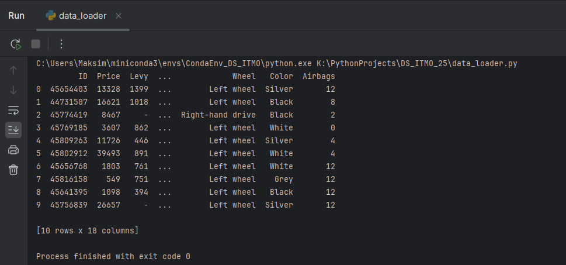
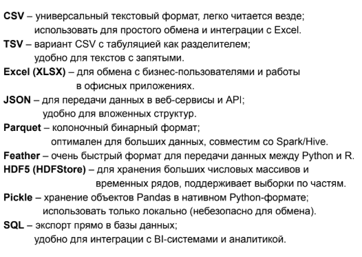

<h1 id="header" align="center">
  Data Engineering project
  
</h1>

> [!NOTE]
> *Данный проект создан в рамках изучения дисциплины "Инжиниринг управления данными" в университете ИТМО.*

<div id="header" align="center">
  
</div>

---

## Описание.
<ins>Идея проекта</ins> - получить знания и опыт в области инжиниринга данными (Data Engineering).

<div>
  Разработка программ работы с базой данных на языке Python.
  
</div>

## Этапы проекта.
- [x] Создание репозитория проекта и поиск dataset.
- [x] Создание скрипта Data_Loader.py для выгрузки dataset с Google Drive и настройка venv и пакетного менеджера Conda+Poetry.
- [x] Выполнение приведения типов в рамках выбранного dataset и сохранение его в формате .parquet.
- [x] Создание [подпроекта](src/API/README.md) c целью обучения выгрузки данных в dataset с API.
- [x] Создание [подпроекта](src/Scrapping/README.md) с целью обучения сбора данных для dataset с помощью скраппинга.
- [x] Осуществить используя накопленные знания EDA над нашим dataset, используя jupiter notebook.
- [x] Найти данные в БД SQLite для входа на серверную БД PostgreSQL и записать 100 строк своего датасета
- [x] Добавить визуализацию в файл с проведенным EDA.

## Dataset.
Прямая ссылка на dataset - https://www.kaggle.com/datasets/deepcontractor/car-price-prediction-challenge?resource=download
\
Ссылка на сохраненный dataset - https://docs.google.com/spreadsheets/d/1PMhtD3LqyCzlZMEh-8aDPxre0wPw8v0U/edit?usp=drive_link&ouid=100105970921534140705&rtpof=true&sd=true

---

## Создание скрипта Data_Loader.py для выгрузки Dataset с Google Drive и настройка Conda+Poetry.
>[!IMPORTANT]
> На вашем компьютере глобально должны быть предустановленны [Conda](https://www.anaconda.com/docs/getting-started/miniconda/install) и [Poetry](https://habr.com/ru/articles/593529/)

### Требования проекта:
 - [Conda >= 24.3.0](https://www.anaconda.com/docs/getting-started/miniconda/install)
 - [python >= 3.11.9](https://www.python.org/downloads/release/python-3119/)
 - [poetry >= 2.2.0](https://habr.com/ru/articles/593529/)
 - pip

### Инструкция по установке Conda+Poetry.
>[!NOTE]
> Инструкция может использоваться для настройки в IDE - Pycharm и Visual Studio Code.

1) Создаем в PyCharm новый проект с любым выбранным interpreter.
2) После создания удаляем ВСЕ имеющиеся файлы в папке проекта.
3) Создаем внутри папки файл ```environment.yml``` в котором прописываем следующий минимум:
    ```
   name: <название вашего окружения>
   channels:
    - conda-forge # канал с актуальными
    пакетами.
    - defaults
   dependencies:
    - python = <ваша версия python>
    - poetry = <ваша версия poetry>
    - pip # для работы poetry внутри conda
   ```

4) Открываем терминал в PyCharm и прописываем:  
`conda env create -f environment.yml`    
`cоnda activate <название вашего окружения>`
5) Ставим Poetry командой:  
`poetry init`

---

**ПРИМЕЧАНИЕ** - все зависимости добавим позже командой `poetry add`

---

6) Для того чтобы *poetry* поставился в виртуальное окружение *conda*
прописываем:  
`poetry config virtualenvs.create false`
7) Прописываем `poetry install`
8) В PyCharm настраиваем interpreter выполняя команды:
    1) `Add local interpreter`
    2) `Conda environments`
    3) `use existing environment`
    4) `<название вашего окружения в выпадающем списке>`
  
---

### Восстановление окружения Conda+Poetry.
>[!IMPORTANT]
> Для восстановления окружения вам понадобятся 3 файла: *environment.yml*, *pyproject.toml* и *poetry.lock*.

1) Проверяем установку Miniconda (при запуске в терминале перед путем папки должно быть слово (base))
2) Прописываем команды:  
`cоnda env create -f environment.yml`  
`cоnda activate <название вашего окружения>`
3) После восстановления окружения из файла *environment.yml* прописываем последовательно следующие команды:  
`poetry config virtualenvs.create false`
`poetry install`
4) Проверяем (на примере Pycharm) interpreter:
    1) `Add local interpreter`
    2) `Conda environments`
    3) `use existing environment`
    4) `<название вашего окружения в выпадающем списке>`
  
---

### Скриншот с результатом команды raw_data.head(10)


---

## Привидение типов данных и сохранение dataset в формате .parquet.
>[!IMPORTANT]
> Программа выполняется запуском файла _main.py_.

### Исследование типов данных dataset до приведения типов.

Выполнив загрузку _dataset_ в директорию data в формате .xslx, используем связку команд (``выполняется скрипт data_loader.py``):  
``pd.set_option("display.max_rows", None)``  
``print(<переменная>["<название признака>"].value_counts().sort_index(ascending=False))``  
``print(<переменная>["<название признака>"].dtypes)`` 

мы исследуем каждый признак на предмет ошибочных значений и типа данных.

В случае моего _dataset_ таких признаков 18 штук.

В итоге, получается следующая таблица c помощью команды:  
``print(<переменная>.info())``  

```
 #   Column           Dtype  
---  ------           -----  
 0   ID               int64  
 1   Price            int64  
 2   Levy             object 
 3   Manufacturer     object 
 4   Model            object 
 5   Prod. year       int64  
 6   Category         object 
 7   Leather interior object 
 8   Fuel type        object 
 9   Engine volume    object 
 10  Mileage          object 
 11  Cylinders        float64
 12  Gear box type    object 
 13  Drive wheels     object 
 14  Doors            object 
 15  Wheel            object 
 16  Color            object 
 17  Airbags          int64  

   ```
 **Общая занимаемая память - 2.6 МB**

---

### Приведение типов данных и изменение ошибочных значений.

После получения таблицы с типами данных и нахождением ошибочных значений действуем по следующему **алгоритму**. (``выполняется скрипт data_conversion.py``)

1) Исправляем ошибочных значения - варианты: замена на NaN, замена на среднее значение показателя.
2) Смотрим на количество уникальных значений и их величину.
3) В зависимости от предыдущего пункта выбираем типы данных исходя из **таблицы**:  

>[!IMPORTANT]
> Для признаков, где встречается NaN необходимо указывать не int, а Int  
4) Производим замену типа данных на нужный нам с помощью команды:  
``<переменная>["<название признака>"].astype("<новый тип данных>")`` 
5) В итоге получаем следующую таблицу:  
```
 #   Column                      Dtype  
---  ------                      -----  
 0   ID                          int32  
 1   Price                       int32  
 2   Levy                        Int16 
 3   Manufacturer                category 
 4   Model                       category 
 5   Prod. year                  int8  
 6   Category                    category 
 7   Have a leather interior?    bool 
 8   Fuel type                   category 
 9   Engine volume               object 
 10  Mileage                     int32 
 11  Cylinders                   int8
 12  Gear box type               category 
 13  Drive wheels                category 
 14  Doors                       category 
 15  Car have a left wheel?      bool 
 16  Color                       category 
 17  Airbags                     int8  

   ```

---

### Сохранение dataset в формате .parquet.
>[!IMPORTANT]
> В вашем виртуальном окружении должна быть установлена зависимость _pyarrow_.

Выбирая из следующих форм сохранения _dataset_, мы остановили выбор на Parquet.


Для сохранения в выбранном типе запускается ``скрипт data_saver.py``.

**Итогом** сохранения является уменьшение используемой памяти с **2.6 MB до 776.6 КB**

В дальнейшем все процедуры будут проводиться с файлом .parquet.

---

## Создание dataset из публичного API.
>[!NOTE]
> Работа программы была описана в вложенном в директории API файле [README.md](src/API/README.md)

---

## Создание dataset с помощью парсинга сайта.
>[!NOTE]
> Работа программы была описана в вложенном в директории Scrapping файле [README.md](src/Scrapping/README.md).  
> Также для работы необходима установленная библиотека BeautifulSoup4.

---

## EDA над dataset.
>[!IMPORTANT]
>Перед работой с данным файлом необходимо обновить вашей виртуальное окружение, так как были добавлены новые зависимости. Кроме того необходимо установить расширение Jupyter Notebook.

Весь процесс анализа и работы с данными в <ins>входном анализе данных (EDA)</ins> представлен в файле [EDA.ipynb](notebooks/EDA.ipynb).

---

## Работа с SQL
>[!IMPORTANT]
> В вашем виртуальном окружении должны быть установлены зависимости _sqlalchemy_ и _psycopg2_.

Работа в данной части проекта подразумевала поиск таблицы access в .db типа SQLite.  
После чего с найденными учетными данными происходило подключение, описанное в файле `write_to_db.py`, к удаленной БД типа PostgreSQL. Уже туда заносились 100 строк данных выбранного в проекте датасета.

---

## Работа с визуализацией
>[!IMPORTANT]
> В вашем виртуальном окружении должна быть установлена зависимость _plotly_ и _statsmodels_.


Данная часть проекта подразумевает работу с визуализацией в нашем файле `EDA.ipynb`.  
Поэтому в файле _jupyter notebook_ были добавлены дополнительные динамические графики и подпункты анализа.  
Из примеров:  


**Основными критериями в данной пункте являлись:**
- Единый кастомный стиль
- Обязательно включить в работу график в виде сетки (несколько-в-одном)


Но так как выбранная библиотека _plotly_ имеет в себе элементы _JavaScript_, то Github не пропускает и не отображает корректно графики. Сделано это в целях безопасности.  
Поэтому с помощью команды:
```
jupyter nbconvert --to html <путь к файлу .ipynb>
```
был создан файл html.

Поэтому полная версия EDA с рабочими графиками _plotly_ представлено в [файле html](notebooks/EDA.html)


