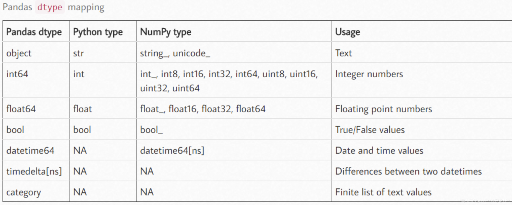

<h1 id="header" align="center">
  Data Engineering project
  
</h1>

> [!NOTE]
> *Перед проектом поставлена задача проведения анализа данных и нахождения зависимостей между ценой и признаком автомобиля.*

<div id="header" align="center">
  
</div>

---

## Описание

<ins>Цели проекта</ins>:

- провести работу над данными;
- найти зависимости между ценой и признаками автомобиля;
- получить знания и опыт в области инжиниринга данными (Data Engineering).

<div>
  Разработка программ работы с базой данных ведется <ins>на языке Python</ins>.
  
</div>

## Этапы проекта

- [x] Создание репозитория проекта и поиск dataset.
- [x] Выгрузка Dataset c Google Drive c помощью `data_loader.py` и настройка окружения.
- [x] Выполнение приведения типов над dataset и сохранение его в формате `.parquet`.
- [x] Создание [подпроекта](docs/README_API.md) c целью выгрузки данных в dataset с API.
- [x] Создание [подпроекта](docs/README_Scrap.md) с целью сбора данных для dataset с помощью скраппинга.
- [x] Проведение EDA над dataset, используя технологию jupiter notebook.
- [x] Работа с базами данных SQLite и PostgreSQL.
- [x] Добавление визуализации в `EDA.ipynb`.
- [x] Создание `ETL` пайплайна.

## Cсылки на dataset

Прямая ссылка на dataset - https://www.kaggle.com/datasets/deepcontractor/car-price-prediction-challenge?resource=download
\
Ссылка на сохраненный dataset - https://docs.google.com/spreadsheets/d/1PMhtD3LqyCzlZMEh-8aDPxre0wPw8v0U/edit?usp=drive_link&ouid=100105970921534140705&rtpof=true&sd=true

---

## Выгрузка Dataset c Google Drive c помощью `data_loader.py` и настройка окружения

>[!IMPORTANT]
> На вашем компьютере глобально должны быть предустановленны [Conda](https://www.anaconda.com/docs/getting-started/miniconda/install) и [Poetry](https://habr.com/ru/articles/593529/)

### Требования проекта:

 - [Conda >= 24.3.0](https://www.anaconda.com/docs/getting-started/miniconda/install)
 - [python >= 3.11.9](https://www.python.org/downloads/release/python-3119/)
 - [poetry >= 2.2.0](https://habr.com/ru/articles/593529/)
 - pip

### Инструкция по установке Conda+Poetry

>[!IMPORTANT]
> Вся инструкция по установке и первичной настройке находится в файле [MANUAL.md](docs/MANUAL.md).

---

### Скриншот с результатом команды raw_data.head(10)


---

## Привидение типов данных и сохранение dataset в формате .parquet

>[!IMPORTANT]
> Программа выполняется запуском файла `main.py`.

После запуска скрипта получаем таблицу c исходными типами данных:  

```
 #   Column           Dtype  
---  ------           -----  
 0   ID               int64  
 1   Price            int64  
 2   Levy             object 
 3   Manufacturer     object 
 4   Model            object 
 5   Prod. year       int64  
 6   Category         object 
 7   Leather interior object 
 8   Fuel type        object 
 9   Engine volume    object 
 10  Mileage          object 
 11  Cylinders        float64
 12  Gear box type    object 
 13  Drive wheels     object 
 14  Doors            object 
 15  Wheel            object 
 16  Color            object 
 17  Airbags          int64  

   ```
 **Общая занимаемая память - 2.6 МB**

---

После используя таблицу:



исправляем типы данных (скрипт `data_conversion.py`) и выводим их:  
```
 #   Column                      Dtype  
---  ------                      -----  
 0   ID                          int32  
 1   Price                       int32  
 2   Levy                        Int16 
 3   Manufacturer                category 
 4   Model                       category 
 5   Prod. year                  int8  
 6   Category                    category 
 7   Have a leather interior?    bool 
 8   Fuel type                   category 
 9   Engine volume               object 
 10  Mileage                     int32 
 11  Cylinders                   int8
 12  Gear box type               category 
 13  Drive wheels                category 
 14  Doors                       category 
 15  Car have a left wheel?      bool 
 16  Color                       category 
 17  Airbags                     int8  

   ```

---

>[!IMPORTANT]
> В вашем виртуальном окружении должна быть установлена зависимость _pyarrow_.

Сохранение dataset в формате `.parquet` происходит с помощью скрипта `data_saver.py`.

**Итогом** является уменьшение используемой памяти с **2.6 MB до 776.6 КB**

В дальнейшем все процедуры будут проводиться с файлом `.parquet`.

---

## Создание dataset из публичного API

>[!NOTE]
> Работа программы была описана в файле [README.md](docs/README_API.md)

---

## Создание dataset с помощью парсинга сайта

>[!NOTE]
> Работа программы была описана в файле [README.md](docs/README_Scrap.md).  
> Также для работы необходима установленная библиотека _BeautifulSoup4_.

---

## EDA над dataset

>[!IMPORTANT]
>Необходимо установить расширение _Jupyter Notebook_.

Весь процесс анализа и работы с данными в <ins>входном анализе данных (EDA)</ins> представлен в файле [EDA.ipynb](notebooks/EDA.ipynb).

---

## Работа с SQL базами данных

>[!IMPORTANT]
> В вашем виртуальном окружении должны быть установлены зависимости _sqlalchemy_ и _psycopg2_.

Работа в данной части проекта подразумевала поиск таблицы access в .db типа SQLite.  
После чего с найденными учетными данными происходило подключение, описанное в файле `write_to_db.py`, к удаленной БД типа PostgreSQL. Уже туда заносились 100 строк данных выбранного в проекте датасета.

---

## Работа с визуализацией.

>[!IMPORTANT]
> В вашем виртуальном окружении должны быть установлены зависимости _plotly_ и _statsmodels_.


Данная часть проекта подразумевает работу с визуализацией в файле `EDA.ipynb`.  
Поэтому в файле _jupyter notebook_ были добавлены дополнительные динамические графики и подпункты анализа.  
Из примеров:  


**Основными критериями в данной пункте являлись:**
- Единый кастомный стиль
- Обязательно включить в работу график в виде сетки (несколько-в-одном)


Но так как выбранная библиотека _plotly_ имеет в себе элементы _JavaScript_, то Github не пропускает и не отображает корректно графики. Сделано это в целях безопасности.  
Поэтому с помощью команды:

```
jupyter nbconvert --to html <путь к файлу .ipynb>
```
был создан файл html.

Полная версия EDA с рабочими графиками _plotly_ представлена в [файле html](notebooks/EDA.html)

---

## Создание ETL процесса

Теперь имея все знания и компетенции необходимо выполнить создание **ETL pipeline**.

>[!NOTE]
>ETL - аббревиатура от **extract, transform, load**

### Структура ETL

```
Car-price-analysis-DE_project/
|
├── src/
|   ├──etl/
│      ├── __init__.py
│      ├── extract.py     # Extract from GDrive, download data from .xlsx file
│      ├── load.py        # Saved data in .parquet, read data from .parquet and download data in  
│      |                   PostgreSQL
│      ├── main.py        # The entry point to the ETL process
|      ├── transform.py   # Cleaning data and conversation types
│      └── validate.py    # Input and output data checks
```

### Описание компонентов ETL

- `etl/extract.py` -> включает в себя следующие действия:
  
   - Загрузка данных с Google Drive, если вызывается команда --force или если данные в директории отсутствуют
   - Загрузка в `main.py` необработанных входных данных

- `etl/load.py`-> включает в себя следующие действия:

  - Сохраняет обработанные выходные данные в формате .parquet
  - Загружает в `main.py` сохраненные ранее выходные данные
  - Выполняет загрузку данных в СУБД PostgreSQL

- `etl/main.py`: -> является основной точкой входа. Содержит следующее CLI-управление:

  - `--size-data-to-db` -> По умолчанию: _100_. Количество строк для записи в БД
  - `--xlsx-name` -> По умолчанию: _"dataset"_. Название XLSX файла (без расширения)
  - `--parquet-name` ->  По умолчанию: _"dataset"_. Название Parquet файла (без расширения)
  - `--data-dir` -> По умолчанию: _берется из .env_. Директория для данных
  - `--no-write-db` -> По умолчанию: _Да_. Записывать в базу данных
  - `--force` -> По умолчанию: _НЕТ_. Перезагружать xlsx файл входных данных

- `etl/transform.py`-> включает в себя следующие действия:

  - Очищаем dataset от ошибок и производим типизацию данных.

- `etl/validate.py` -> включает в себя следующие действия:

  - Проверка нахождения в указанной директории нужного файла .xlsx
  - Проверка нахождения в указанной директории нужного файла .parquet
  - Проведение валидации входных данных
  - Проведение валидации выходных данных


### Команды для запуска и пример вывода

```
python -m src.etl.main
python -m src.etl.main --size-data-to-db 50 --force
python -m src.etl.main --xlsx-name data_car --parquet-name data_clean_car --no-write-db
python -m src.etl.main --data-dir data/test

```


**Пример вывода данных(`python -m src.etl.main`)**:

```
============================================================
--ЗАПУСК ETL--
============================================================

Размер выборки для БД: 100

XLSX файл: dataset.xlsx

Parquet файл: dataset.parquet

Директория данных: data\ETL

Запись в БД: ДА

Принудительная перезагрузка: НЕТ

============================================================


============================================================
--ПРОВЕРКА НАЛИЧИЯ DATASET В ФОРМАТЕ .PARQUET В ДИРЕКТОРИИ data/processed--
============================================================

Dataset в формате .parquet найден!
Валидация выходных данных...

============================================================
--ПРОВЕРКА ВЫХОДНЫХ ДАННЫХ--
============================================================


 Пункт 1 -> Пропуски:

   - id: 0 пропусков
   - price: 0 пропусков
   - tax: 0 пропусков
   - manufacturer: 0 пропусков
   - model: 0 пропусков
   - release_year: 0 пропусков
   - car_type: 0 пропусков
   - have_a_leather_interior: 0 пропусков
   - fuel_type: 0 пропусков
   - engine_volume: 0 пропусков
   - mileage: 0 пропусков
   - transmission_type: 0 пропусков
   - doors: 0 пропусков
   - car_have_a_left_wheel: 0 пропусков

 Пункт 2 -> Типы данных:

   - id: int32 Успешно
   - price: int32 Успешно
   - tax: int32 Успешно
   - manufacturer: category Успешно
   - model: category Успешно
   - release_year: int16 Успешно
   - car_type: category Успешно
   - fuel_type: category Успешно
   - engine_volume: object Успешно
   - mileage: int32 Успешно
   - transmission_type: category Успешно
   - doors: category Успешно
   - have_a_leather_interior: bool Успешно
   - car_have_a_left_wheel: bool Успешно

 Пункт 3 -> Дубликаты: 0 записей


============================================================
--ЗАВЕРШЕНО--
============================================================

Запись в базу данных...


============================================================
--Загрузка в БД после преобразований--
============================================================

Данные записаны в таблицу titov_test, количество строк 100
Первичный ключ успешно добавлен!
Таблица titov_test успешно найдена!

Выводим первые 5 строк...

      id  price  tax manufacturer   model  release_year  car_type  have_a_leather_interior fuel_type engine_volume  mileage transmission_type  doors  car_have_a_left_wheel
45654403  13328 1399        LEXUS  RX 450          2010      Jeep                     True    Hybrid           3.5   186005         Automatic 04-May                   True
44731507  16621 1018    CHEVROLET Equinox          2011      Jeep                    False    Petrol             3   192000         Tiptronic 04-May                   True
45774419   8467  781        HONDA     FIT          2006 Hatchback                    False    Petrol           1.3   200000          Variator 04-May                  False
45769185   3607  862         FORD  Escape          2011      Jeep                     True    Hybrid           2.5   168966         Automatic 04-May                   True
45809263  11726  446        HONDA     FIT          2014 Hatchback                     True    Petrol           1.3    91901         Automatic 04-May                   True

============================================================
--ETL УСПЕШНО ОКОНЧЕН -> ВЫВОД ДАННЫХ--
============================================================

<class 'pandas.core.frame.DataFrame'>
RangeIndex: 18289 entries, 0 to 18288
Data columns (total 14 columns):
 #   Column                   Non-Null Count  Dtype
---  ------                   --------------  -----
 0   id                       18289 non-null  int32
 1   price                    18289 non-null  int32
 2   tax                      18289 non-null  int32
 3   manufacturer             18289 non-null  category
 4   model                    18289 non-null  category
 5   release_year             18289 non-null  int16
 6   car_type                 18289 non-null  category
 7   have_a_leather_interior  18289 non-null  bool
 8   fuel_type                18289 non-null  category
 9   engine_volume            18289 non-null  object
 10  mileage                  18289 non-null  int32
 11  transmission_type        18289 non-null  category
 12  doors                    18289 non-null  category
 13  car_have_a_left_wheel    18289 non-null  bool
dtypes: bool(2), category(6), int16(1), int32(4), object(1)
memory usage: 673.5+ KB
```


