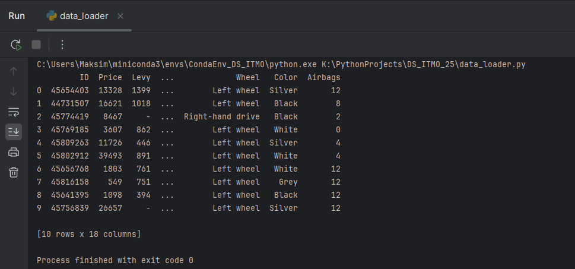

<h1 id="header" align="center">
  Data Science project - ITMO 2025
  
</h1>

> [!NOTE]
> *Данный проект создан в рамках изучения дисциплины "Инжиниринг управления данными" в университете ИТМО.*

<div id="header" align="center">
  
</div>

---

## Краткое содержание проекта.
- [Описание.](#Описание.)
- [Составляющие проекта.](#Составляющие_проекта.)
- [Dataset.](#Dataset.)

## Описание.
<ins>Идея проекта</ins> - получить знания и опыт в области инжиниринга данными (Data Science).

<div>
  Разработка программ работы с базой данных на языке Python.
  
</div>

## Составляющие проекта.
- [Создание репозитория проекта и поиск Dataset.](#Dataset.)
- [Создание скрипта Data_Loader.py для выгрузки Dataset с Google Drive и настройка venv и пакетного менеджера Conda+Poetry.](#Создание_скрипта_Data_Loader.py_для_выгрузки_Dataset_с_Google_Drive_и_настройка_venv_и_пакетного_менеджера_Conda+Poetry.)
- []

## Dataset.
Прямая ссылка на dataset - https://www.kaggle.com/datasets/deepcontractor/car-price-prediction-challenge?resource=download
\
Ссылка на сохраненный dataset - https://docs.google.com/spreadsheets/d/1PMhtD3LqyCzlZMEh-8aDPxre0wPw8v0U/edit?usp=drive_link&ouid=100105970921534140705&rtpof=true&sd=true

---

## Создание скрипта Data_Loader.py для выгрузки Dataset с Google Drive и настройка Conda+Poetry.
>[!IMPORTANT]
> На вашем компьютере глобально должны быть предустановленны [Conda](https://www.anaconda.com/docs/getting-started/miniconda/install) и [Poetry](https://habr.com/ru/articles/593529/)

### Требования проекта:
 - [Conda >= 24.3.0](https://www.anaconda.com/docs/getting-started/miniconda/install)
 - [python >= 3.11.9](https://www.python.org/downloads/release/python-3119/)
 - [poetry >= 2.2.0](https://habr.com/ru/articles/593529/)
 - pip

### Инструкция по установке Conda+Poetry.
>[!NOTE]
> Инструкция может использоваться для настройки в IDE - Pycharm и Visual Studio Code.

1) Создаем в PyCharm новый проект с любым выбранным interpreter.
2) После создания удаляем ВСЕ имеющиеся файлы в папке проекта.
3) Создаем внутри папки файл ```environment.yml``` в котором прописываем следующий минимум:
    ```
   name: <название вашего окружения>
   channels:
    - conda-forge # канал с актуальными
    пакетами.
    - defaults
   dependencies:
    - python = <ваша версия python>
    - poetry = <ваша версия poetry>
    - pip # для работы poetry внутри conda
   ```

4) Открываем терминал в PyCharm и прописываем:  
`cоnda env create -f environment.yml`    
`cоnda activate <название вашего окружения>`
5) Ставим Poetry командой:  
`poetry init`

---

**ПРИМЕЧАНИЕ** - все зависимости добавим позже командой `poetry add`

---

6) Для того чтобы *poetry* поставился в виртуальное окружение *conda*
прописываем:  
`poetry config virtualenvs.create false`
7) Прописываем `poetry install`
8) В PyCharm настраиваем interpreter выполняя команды:
    1) `Add local interpreter`
    2) `Conda environments`
    3) `use existing environment`
    4) `<название вашего окружения в выпадающем списке>`
  
---

### Восстановление окружения Conda+Poetry.
>[!IMPORTANT]
> Для восстановления окружения вам понадобятся 3 файла: *environment.yml*, *pyproject.toml* и *poetry.lock*.

1) Проверяем установку Miniconda (при запуске в терминале перед путем папки должно быть слово (base))
2) Прописываем команды:  
`cоnda env create -f environment.yml`  
`cоnda activate <название вашего окружения>`
3) После восстановления окружения из файла *environment.yml* прописываем последовательно следующие команды:  
`poetry config virtualenvs.create false`
`poetry install`
4) Проверяем (на примере Pycharm) interpreter:
    1) `Add local interpreter`
    2) `Conda environments`
    3) `use existing environment`
    4) `<название вашего окружения в выпадающем списке>`
  
---

### Скриншот с результатом команды raw_data.head(10)



