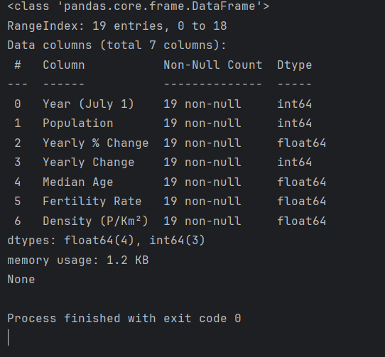

<h1 id="header" align="center">

  Subproject -> scrapping dataset from site
  
</h1>

---

## Описание
_Подпроект_ является частью общего проекта, выполняемого в рамках курса **Инжиниринг управления данными** в университете
ИТМО.
_Задачей_ подпроекта является парсинг данных с сайта в dataset.csv и dataset.parquet
для дальнейшей обработки.

Вся основная информация о проекте представлены в файле [README.md](../README.md)

---

## Выбранный сайт

Ссылка на выбранный в подпроекте сайт - https://www.worldometers.info/world-population/

Мы будем парсить данные из таблицы мировой популяции человечества с 1955 по 2025 года.

---

## Ход работы

1) Подключаем инструменты скраппинга. В нашем случае библиотеку BeautifulSoup4.  
Команда на подключение - ``poetry add beautifulsoup4``
2) Создаем адекватный запрос к сайту с использованием ``user-agent``. И выполняем запрос.
3) Открыв код на сайте ищем нашу таблицу в разметке html.
4) В нашей же программе с помощью   ``BeautifulSoup(r.text, "html.parser")``
достаем код страницы.
5) Находим нашу таблицу с помощью маркеров (в нашем случае _datatable_). И загружаем в функцию вычленения табличных характеристик.
6) Загружаем данные и признаки в скрипт с _DataFrame_, где происходит их сохранение в формат .csv, типизация данных и сохранение в формат .parquet для дальнейшей работы.

**ВЫВОД В ТЕРМИНАЛЕ РАБОТЫ ПРОГРАММЫ** 

